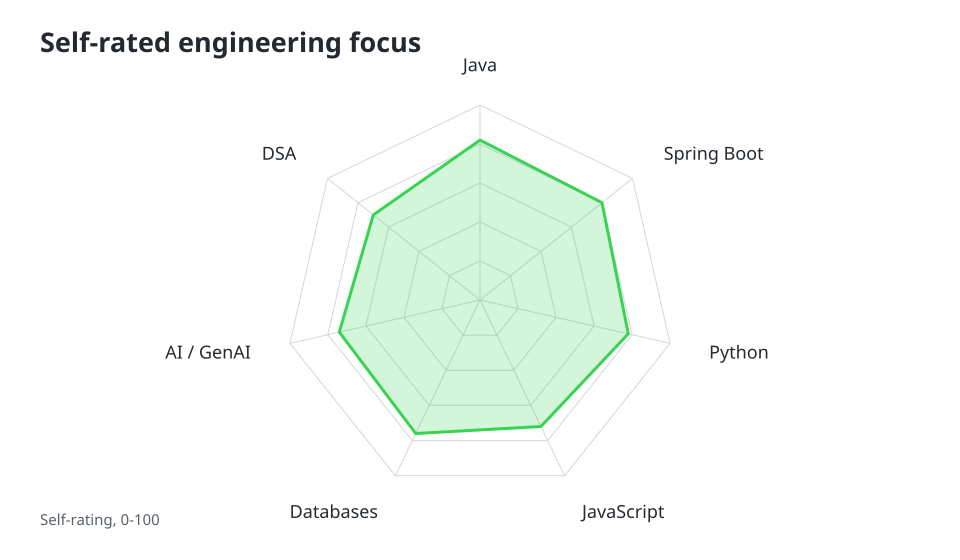
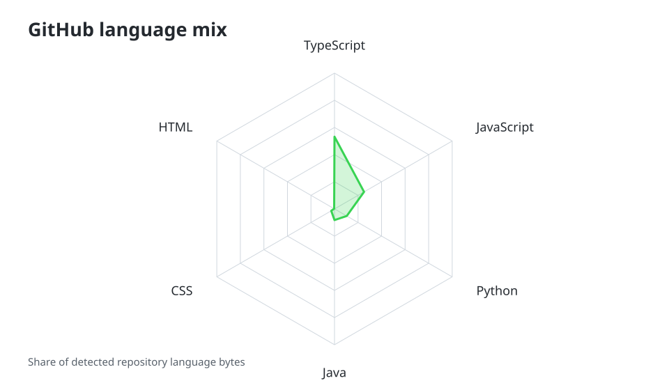
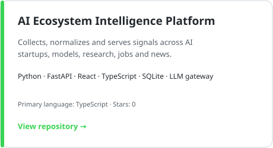
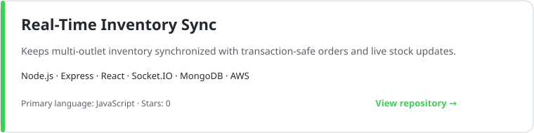
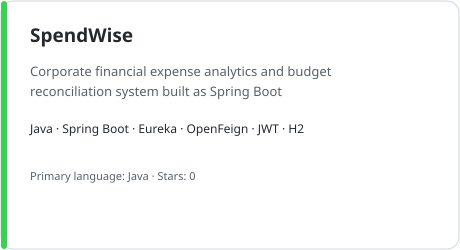
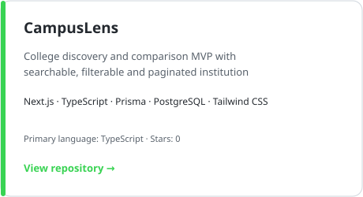

# Krishna Magar

### Software Engineer · Computer Science Engineer

Backend systems · Java & Spring Boot · Microservices · Python · AI / GenAI · Full-stack development

  <a href="https://www.linkedin.com/in/krishna-magar-cse/">LinkedIn</a> ·
  <a href="mailto:magarkrishna448pc@gmail.com">Email</a> ·
  <a href="https://github.com/2400030948">GitHub</a>

## About

I’m Krishna, a computer science engineer building software across backend services, data-driven applications, and full-stack products. I’m particularly interested in how APIs, databases, service boundaries, and real-time workflows fit together in dependable systems.

Currently, I’m developing with Java and Spring Boot, Python, JavaScript/TypeScript, and modern web frameworks while exploring LLM applications, RAG, embeddings, agent workflows, and automation.

## Tech Stack

  

| Engineering area | Current focus |
| --- | --- |
| Backend | Java, Spring Boot, Python, FastAPI, Node.js, REST APIs |
| Architecture | Microservices, service discovery, API gateways, distributed workflows |
| Frontend | React, Next.js, TypeScript |
| Data | PostgreSQL, MongoDB, MySQL, SQLite |
| AI / GenAI | LLMs, RAG, embeddings, AI agents, tool calling, automation |
| Foundations | Data structures, algorithms, concurrency, real-time systems |
| Delivery | Git, GitHub, Docker, AWS |

## Skill Radar

These are personal working self-ratings, not certifications or formal assessments.

<picture>
  <source media="(prefers-color-scheme: dark)" srcset="assets/radar-dark.svg">
  <source media="(prefers-color-scheme: light)" srcset="assets/radar-light.svg">
  
</picture>

## GitHub Language Mix

Generated from the language byte counts of my public, non-fork repositories. The radar is refreshed by GitHub Actions and excludes file categories such as shell and Dockerfile.

<picture>
  <source media="(prefers-color-scheme: dark)" srcset="assets/languages-radar-dark.svg">
  <source media="(prefers-color-scheme: light)" srcset="assets/languages-radar-light.svg">
  
</picture>

## GitHub Activity

The contribution calendar is available on my [GitHub profile](https://github.com/2400030948). Generated metrics and snake visuals are maintained by scheduled workflows. Once those workflows have run, they can be opened from the repository’s `assets/github-metrics.svg`, `output/snake-dark.svg`, and `output/snake-light.svg` files.

<a href="https://github.com/2400030948/2400030948/actions">Open profile asset workflows</a>

## Featured Projects

<table>
  <tr>
    <td><a href="https://github.com/2400030948/ai-ecosystem-intelligence-platform"><picture><source media="(prefers-color-scheme: dark)" srcset="assets/project-1-dark.svg"><source media="(prefers-color-scheme: light)" srcset="assets/project-1-light.svg"></picture></a> <a href="https://github.com/2400030948/ai-ecosystem-intelligence-platform">View repository →</a></td>
    <td><a href="https://github.com/2400030948/realtime-inventory-sync"><picture><source media="(prefers-color-scheme: dark)" srcset="assets/project-2-dark.svg"><source media="(prefers-color-scheme: light)" srcset="assets/project-2-light.svg"></picture></a> <a href="https://github.com/2400030948/realtime-inventory-sync">View repository →</a></td>
  </tr>
  <tr>
    <td><a href="https://github.com/2400030948/spendwise"><picture><source media="(prefers-color-scheme: dark)" srcset="assets/project-3-dark.svg"><source media="(prefers-color-scheme: light)" srcset="assets/project-3-light.svg"></picture></a> <a href="https://github.com/2400030948/spendwise">View repository →</a></td>
    <td><a href="https://github.com/2400030948/campuslens"><picture><source media="(prefers-color-scheme: dark)" srcset="assets/project-4-dark.svg"><source media="(prefers-color-scheme: light)" srcset="assets/project-4-light.svg"></picture></a> <a href="https://github.com/2400030948/campuslens">View repository →</a></td>
  </tr>
</table>

## Competitive Programming

| Platform | Profile |
| --- | --- |
| LeetCode | [kl2400030948](https://leetcode.com/u/kl2400030948/) |
| CodeChef | [kl_2400030948](https://www.codechef.com/users/kl_2400030948) |
| Codeforces | [kl2400030948](https://codeforces.com/profile/kl2400030948) |
| HackerRank | [h2400030948](https://www.hackerrank.com/h2400030948) |
| InterviewBit | [krishna_627](https://www.interviewbit.com/profile/krishna_627/) |

## Contact

For engineering conversations, collaboration, or project discussions:

<a href="mailto:magarkrishna448pc@gmail.com">magarkrishna448pc@gmail.com</a> · <a href="https://www.linkedin.com/in/krishna-magar-cse/">LinkedIn</a>

Build thoughtfully. Learn continuously.

